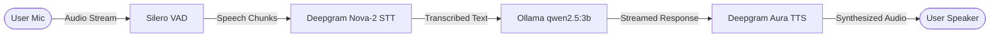

# 🎙️ VoiceAgent — Real-Time Conversational Voice AI

A low-latency, bidirectional conversational voice assistant built with **LiveKit Agents**, **Deepgram (STT & TTS)**, **Silero VAD**, and local **Ollama (`qwen2.5:3b`)**. Features an interactive web interface with an animated visual orb that reflects speech states in real time.

[](https://www.python.org/)
[](https://livekit.io/)
[](https://deepgram.com/)
[](https://ollama.com/)
[](https://opensource.org/licenses/MIT)

---

## ⚡ Architecture & Pipeline



1. **VAD (Voice Activity Detection):** [Silero VAD](https://github.com/snakers4/silero-vad) accurately detects speech start and stop on the client/edge.
2. **STT (Speech-to-Text):** [Deepgram Nova-2](https://deepgram.com) converts incoming voice to text with sub-second latency.
3. **LLM (Language Model):** Local [Ollama](https://ollama.com) running `qwen2.5:3b` crafts natural, concise responses formatted specifically for voice.
4. **TTS (Text-to-Speech):** [Deepgram Aura](https://deepgram.com/aura) (`aura-asteria-en`) produces natural, expressive voice output.
5. **Transport:** LiveKit WebRTC handles bidirectional, low-latency audio transmission with interruption support.

---

## 📁 Project Structure

```
VoiceAgent/
├── agent.py            # LiveKit Voice pipeline worker (VAD, STT, LLM, TTS)
├── token_server.py     # FastAPI server issuing LiveKit room JWT tokens & serving UI
├── requirements.txt    # Python dependencies (livekit-agents, deepgram, etc.)
├── .env.example        # Environment variable template
├── .gitignore          # Ignores sensitive .env file
└── static/
    ├── index.html      # Voice assistant UI
    ├── style.css       # Pulsing animated orb & transcript styles
    └── app.js          # LiveKit Web SDK client & room event handlers
```

---

## ⚙️ Prerequisites

1. **Python 3.10+**
2. **Ollama** installed with `qwen2.5:3b` pulled:
   ```bash
   ollama pull qwen2.5:3b
   ```
3. **LiveKit Cloud Account:** Free credentials from [cloud.livekit.io](https://cloud.livekit.io)
4. **Deepgram Account:** Free API key from [console.deepgram.com](https://console.deepgram.com)

---

## 🔑 Environment Configuration

Create a `.env` file in the `VoiceAgent/` folder (or copy `.env.example`):

```bash
cp .env.example .env
```

Fill in your credentials inside `.env`:

```env
# LiveKit Cloud credentials (https://cloud.livekit.io → Project Settings → Keys)
LIVEKIT_URL=wss://YOUR_PROJECT.livekit.cloud
LIVEKIT_API_KEY=YOUR_API_KEY
LIVEKIT_API_SECRET=YOUR_API_SECRET

# Deepgram API key (https://console.deepgram.com → API Keys)
DEEPGRAM_API_KEY=YOUR_DEEPGRAM_API_KEY
```

> ⚠️ **Important:** Never commit your `.env` file to GitHub. It is already included in `.gitignore`.

---

## 🚀 Running VoiceAgent

VoiceAgent requires **two separate processes** running simultaneously.

### Step 1: Install Dependencies
```bash
cd VoiceAgent
pip install -r requirements.txt
```

### Step 2: Start the Token & Web Server (Terminal 1)
```bash
python token_server.py
```
*Starts the UI and LiveKit token generator at `http://127.0.0.1:8001`.*

### Step 3: Start the Voice Agent Pipeline Worker (Terminal 2)
```bash
python agent.py dev
```
*Connects the agent worker to your LiveKit room and waits for incoming connections.*

### Step 4: Connect & Speak
1. Open **[http://localhost:8001](http://localhost:8001)** in Chrome or Edge.
2. Grant microphone access when prompted.
3. Click **"Connect"**.
4. The agent will greet you and the animated orb will shift through **Listening**, **Thinking**, and **Speaking** states.

---

## 👤 Author

Developed by **[M-USMAN-SAFDAR](https://github.com/M-USMAN-SAFDAR)**.
