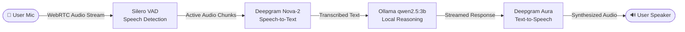

# 🎙️ VoiceAgent — Real-Time Conversational Voice AI

A low-latency, bidirectional conversational voice assistant built with **LiveKit Agents**, **Deepgram (Nova-2 STT & Aura TTS)**, **Silero VAD**, and local **Ollama (`qwen2.5:3b`)**. 

Features a modern web interface with an **interactive glowing orb** that responds visually to conversation states (*Listening*, *Thinking*, *Speaking*) with live audio streaming and transcription.

[](https://github.com/M-USMAN-SAFDAR/voiceAgent)
[](https://www.python.org/)
[](https://livekit.io/)
[](https://deepgram.com/)
[](https://ollama.com/)
[](https://opensource.org/licenses/MIT)

---

## ⚡ Architecture Pipeline



| Component | Technology | Purpose |
| :--- | :--- | :--- |
| **VAD** | [Silero VAD](https://github.com/snakers4/silero-vad) | Detects speech boundaries with high accuracy and low CPU usage |
| **STT** | [Deepgram Nova-2](https://deepgram.com) | Real-time audio streaming transcription |
| **LLM** | [Ollama](https://ollama.com) (`qwen2.5:3b`) | 100% local language model tuned for conversational voice replies |
| **TTS** | [Deepgram Aura](https://deepgram.com/aura) (`aura-asteria-en`) | Low-latency human-like neural voice synthesis |
| **Transport** | [LiveKit WebRTC](https://livekit.io) | Low-latency bidirectional media streaming with interruption support |
| **Server** | [FastAPI](https://fastapi.tiangolo.com) | Generates LiveKit room tokens and serves the web client |

---

## 📁 Repository Structure

```
├── agent.py            # LiveKit voice pipeline worker (VAD, STT, LLM, TTS)
├── token_server.py     # FastAPI server issuing room access tokens & serving UI
├── requirements.txt    # Python package dependencies
├── .env.example        # Environment variable template
├── .gitignore          # Excludes secrets (.env) and Python cache
└── static/
    ├── index.html      # Voice assistant single-page interface
    ├── style.css       # Animated reactive orb & glassmorphic UI
    └── app.js          # LiveKit Web SDK client & room event handlers
```

---

## ⚙️ Prerequisites

1. **Python 3.10+** installed.
2. **Ollama** installed on your system:
   - Download from [ollama.com](https://ollama.com)
   - Pull the model:
     ```bash
     ollama pull qwen2.5:3b
     ```
3. **LiveKit Cloud Account:** Free project from [cloud.livekit.io](https://cloud.livekit.io)
4. **Deepgram Account:** Free API key from [console.deepgram.com](https://console.deepgram.com)

---

## 🔑 Environment Setup

1. **Clone the repository:**
   ```bash
   git clone https://github.com/M-USMAN-SAFDAR/voiceAgent.git
   cd voiceAgent
   ```

2. **Create your `.env` file:**
   ```bash
   cp .env.example .env
   ```

3. **Configure your keys inside `.env`:**
   ```env
   # LiveKit Cloud credentials (https://cloud.livekit.io → Project Settings → Keys)
   LIVEKIT_URL=wss://YOUR_PROJECT.livekit.cloud
   LIVEKIT_API_KEY=YOUR_API_KEY
   LIVEKIT_API_SECRET=YOUR_API_SECRET

   # Deepgram API key (https://console.deepgram.com → API Keys)
   DEEPGRAM_API_KEY=YOUR_DEEPGRAM_API_KEY
   ```

> 🔒 **Security Notice:** Never commit `.env` to GitHub. It is ignored by `.gitignore`.

---

## 🚀 Running the Project

VoiceAgent runs with two processes: the **Token Server & UI** and the **LiveKit Agent Worker**.

### Step 1: Install Dependencies
```bash
pip install -r requirements.txt
```

### Step 2: Ensure Ollama is Running
```bash
ollama serve
```

### Step 3: Start the Token & Web Server (Terminal 1)
```bash
python token_server.py
```
*Server starts on `http://127.0.0.1:8001`.*

### Step 4: Start the Voice Agent Pipeline Worker (Terminal 2)
```bash
python agent.py dev
```
*Connects the agent worker to your LiveKit Cloud room and listens for incoming connections.*

### Step 5: Join & Talk
1. Open **[http://localhost:8001](http://localhost:8001)** in your browser (Chrome or Edge recommended).
2. Allow microphone access when prompted.
3. Click **"Connect"**.
4. Speak naturally — the agent will listen, think, and respond with voice while updating the transcript in real-time.

---

## 🎨 Interactive UI States

| State | Orb Visual | Description |
| :--- | :--- | :--- |
| **Idle** | Soft pulsing purple glow | Ready to connect |
| **Listening** | Bright expanding turquoise | User is speaking into microphone |
| **Thinking** | Shimmering violet | Model generating speech response |
| **Speaking** | High-energy dynamic pulse | Agent actively responding with voice |

---

## 🔧 Troubleshooting

- **Microphone not working:** Ensure browser permissions allow microphone access for `localhost:8001`.
- **Model not found:** Run `ollama list` to verify `qwen2.5:3b` is downloaded. Run `ollama pull qwen2.5:3b` if missing.
- **Connection Error:** Double-check your `LIVEKIT_URL`, `LIVEKIT_API_KEY`, and `LIVEKIT_API_SECRET` in `.env`.
- **Agent not speaking:** Verify that `DEEPGRAM_API_KEY` has active credits and that `agent.py dev` is running in Terminal 2.

---

## 👤 Author

Developed by **[M-USMAN-SAFDAR](https://github.com/M-USMAN-SAFDAR)**.

---

## 📄 License

This project is licensed under the MIT License.
